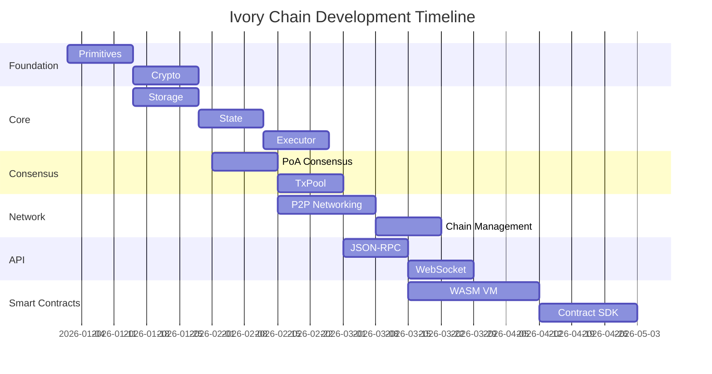

```mermaid
gantt
    title Ivory Chain Development Timeline
    dateFormat  YYYY-MM-DD
    section Foundation
    Primitives           :a1, 2026-01-01, 14d
    Crypto               :a2, after a1, 14d
    section Core
    Storage              :b1, 2026-01-15, 14d
    State                :b2, after b1, 14d
    Executor             :b3, after b2, 14d
    section Consensus
    PoA Consensus        :c1, 2026-02-01, 14d
    TxPool               :c2, after c1, 14d
    section Network
    P2P Networking       :d1, 2026-02-15, 21d
    Chain Management     :d2, after d1, 14d
    section API
    JSON-RPC             :e1, 2026-03-01, 14d
    WebSocket            :e2, after e1, 14d
    section Smart Contracts
    WASM VM              :f1, 2026-03-15, 28d
    Contract SDK         :f2, after f1, 21d
```
